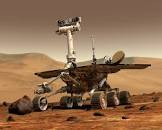
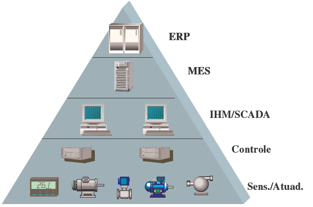

## Linguagem de Programação para Robótica

Robótica -> Robô \(robot\)

1. O que é um robô?
2. Para o que serve?
3. Como montamos e que peças precisamos?

## Ementa

> Introdução à robótica, automação industrial e automação residencial. SCADA.
Microcontroladores. Arduino. Sensores. Atuadores. Programação de tempo real.
Introdução à inteligência artificial aplicada à robótica.

### Objetivo

- Capacitar o aluno a programar aplicações de automação industrial ou residencial.

-------------------------------------------------------------------------------

### Competências

- Identificar os componentes de uma aplicação de automação.
- Compreender os problemas e soluções para programar aplicações de tempo real
 para automação.
- Analisar aplicações de robótica.

### Habilidades

- Projetar aplicações de automação de pequeno porte.
- Especificar soluções para pequenos problemas de automação.
- Programar microcontroladores.

-------------------------------------------------------------------------------

  *"I can't define a robot, but I know one when I see one."*"

  Joseph F Engelberger, pai da Robótica

  *aparelho automático, geralmente em forma de boneco,
  que é capaz de cumprir determinadas tarefas.
  Fig. Pessoa que procede como um robô, isto é, que
  executa ordens sem pensar.*

  Dicionário Aurélio

  *Robô é um manipulador re-programável e multifuncional
  projetado para mover materiais, partes, ferramentas ou
  dispositivos especializados através de movimentos
  variáveis programados para desempenhar uma variedade
  de tarefas.*

  Definição da R.I.A. \(Robotics Industries Association\)

-------------------------------------------------------------------------------

  A robótica caracteriza-se como ciência
  multidisciplinar, a qual envolve temáticas como mecânica, eletrônica, hidráulica,
  pneumática e computação, todas unidas no desenvolvimento de determinados robôs.

-------------------------------------------------------------------------------

Isaac Asimov,  criador das famosas três leis fundamentais da robótica:

1. Um robô não pode causar dano a um ser humano nem, por omissão, permitir que um ser humano sofra;
2. Um robô deve obedecer às ordens dadas por seres humanos, exceto quando essas ordens entrarem em conflito com a Primeira Lei; e
3. Um robô deve proteger sua própria existência, desde que essa proteção não se choque com a Primeira nem com a Segunda Lei da robótica.

-------------------------------------------------------------------------------

## Robótica na ficção

### Metropolis

-------------------------------------------------------------------------------

### I Robot

-------------------------------------------------------------------------------

## Robótica Industrial

-------------------------------------------------------------------------------

-------------------------------------------------------------------------------

-------------------------------------------------------------------------------

-------------------------------------------------------------------------------

## Componentes de um Robô

- Controlador
- Sensores
- Atuadores
- Manipuladores
- Engrenagens
- Eixos
- Fonte de Energia
- Fiação
- Estrutura

## Kits Educacionais de Robótica

- Lego: Mindstorm
- Vex
- PNCA: ALFA

## Programação de Robôs

- Diversas formas de se programar
- C/C++ ou Java
- API específica de robôs comerciais para determinadas linguagens

### Linguagem Gráfica

- LabView - Linguagem da National Inc. - automação, LEGO

### Linguagens Textuais

## Automação

- Os sistemas mais simples de automação são os supervisórios:
  + monitora e rastreia as informações de um processo produtivo ou de
  uma instalação física
- SCADA \(Supervisory Control And Data Acquision\)
- Primeiros SCADA: basicamente telemétricos, informação periódica do estado
de um processo industrial
- Sistemas atuais de automação: utilizam tecnologias de computação e comunicação
para automatizar a monitoração e o controle dos processos industriais, efetuando
coleta de dados e apresentação de modo amigável para o operador com recursos
gráficos \(interface humano-máquina\) e conteúdo multimídia.

## Exemplo de tela de SCADA

## Hierarquia dos Sistemas  de Automação

## Camadas de Uma Hierarquia de Automação

## Atuação do TADS no Sistema

O profissional de TADS atua na:

- programação do sistema de supervisão \(configuração de sensores, atuadores,
  aparência das telas\)
- programação de ERP

NÃO atua no projeto do controle de manufatura ou de processos. Mas pode
programar os controladores.

## Arduino

## Placa de Arduino

- A placa de um arduino é uma placa com um microcontrolador Atmel
- Um microcontrolador é um SoC - System-on-Chip
- O microcontrolador possui:
  + processador de 32 bits
  + Pinos de Entradas e Saídas digitais, algumas entradas *analógicas* e uma,
  ou mais saídas PWM \(modulação em largura de pulso\)
  + memória para dados
  + memória para programa

## IDE do Arduino

## IDE do Arduino

Ambiente de programação do Arduino:
- possui editor de programas que permite compilar o programa C e
descarregá-lo no microcontrolador através da interface USB
- possui uma console para mostrar os dados lidos pela interface serial \(USB\)
- tem acesso a uma grande quantidade de exemplos práticos para as
principais interfaces \(shields\) do Arduino
- usa o gcc para compilar e o gdb para depurar os programas.
