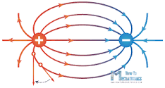

## Recordação

A robótica caracteriza-se como ciência
multidisciplinar, a qual envolve temáticas como mecânica, eletrônica, hidráulica,
pneumática e computação, todas unidas no desenvolvimento de determinados robôs.

* Mecânica, hidráulica e pneumática não serão abordados nesta disciplina. Apenas vamos rever os conceitos de:
  - Velocidade
  - Força
  - Torque
  - Energia e trabalho
  - Potência

## Eletrônica: conceitos de eletricidade
  - Carga elétrica
  - campo elétrico
  - DDP - tensão
  - corrente
  - resistência
  - capacitância
  - transistor
  - diodo

## Carga Elétrica
* Propriedade da matéria
* Principais cargas elementares:
  - elétrons
  - prótons
  - Outras partícula subatômicas também têm carga elétrica, como o méson, mas não estamos interessados nelas (elas não contribuem para a construção de dispositivos eletrônicos)
  - Os átomos são compostos por elétrons, prótons e nêutrons.
  - Desequilíbrios na quantidade de elétrons e prótons resultam em íons que são moléculas com desequilíbrios de cargas elétricas.
  - Em soluções, os íons se deslocam provocando corrente elétrica.
  - Em sólidos (metais), são os elétrons que se movem.

## Campo Elétrico

  - As cargas elétricas se atraem segundo a lei de Coulomb: $F_{q_1,q_2} = K \frac{Q_1 Q_2}{r^2}$
  - Uma carga elétrica sózinha é dita possuir um campo elétrico porque se colocarmos uma outra carga elétrica de prova nas proximidades dela, as duas cargas elétricas experimentam uma força nelas. O campo elétrico não depende da existência da carga de prova, ele é uma característica da carga elétrica original.

## DDP Diferença de potencial - Tensão

  - 2 pontos diferentes do espaço em volta de uma carga elétrica podem ter *Potenciais Elétricos* diferentes: é necessário realizar trabalho para movimentar uma carga de um nível de potencial para um outro, a diferença de potencial (DDP) é chamada de tensão e medida em Volts (V).
  - É necessário ter uma diferença de tensão para que uma carga se movimente de um lugar para o outro. O movimento de cargas é chamado de **corrente** e medido em Ampères (A).

## Resistência ôhmica

* Lei de Ohm: $V = R \cdot I$ ou $R = \frac{V}{I}$
* Aplicação:

Calcule R para que a tensão sobre o resistor seja de 3,3V e a corrente de 20mA.

## Capacitância

- Campos elétricos em metais fazem com que os elétrons movimentem para se arranjarem de modo a equilibrar as forças elétricas. Quando
tentamos mudar o campo elétrico, existe uma *resistência* para mudar devido à configuração dos elétrons. Esta *resistência* em mudar o campo elétrico é cahamada de capacitância e se traduz em uma dificuldade para mudar a diferenca de potencial entre elementos metáticos.
Isto é, capacitância não deixa a tensão mudar facilmente, é necessário gastar energia para fazer esta mudança.

## Movimento de cargas

- O movimento de cargas, corrente, provoca o aparecimento de campos magnéticos. Diferente da carga elétrica, não existe uma carga magnética na natureza, o campo magnético é devido ao movimento de cargas elétricas.
- Ao circular uma corrente elétrica num fio, o campo magnético é *induzido* pela corrente no fio. Este campo magnético faz com que a corrente não possa ser mudada facilmente. Este é o efeito de um indutor. Indultâncias resistem à mudanças na corrente, de novo, é necessário gastar energia para mudar o valor da corrente. **Indultância** é uma propriedade dos materiais.
