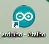
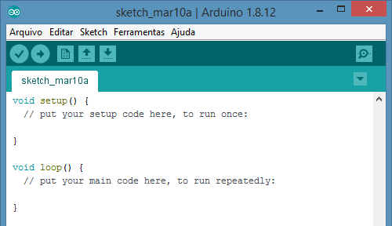
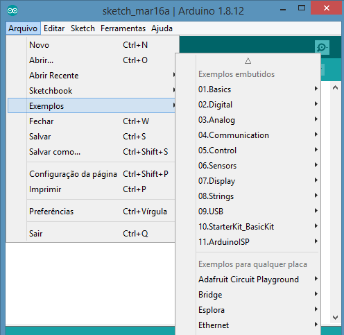

## Arduino

* link: https://store.arduino.cc/usa/arduino-uno-rev3

* link: https://www.electronics-notes.com/articles/electronic_components/diode/light-emitting-diode-led-datasheet-specifications-parameters-characteristics.php

## Uso do ambiente de programação do Arduino

* Acione o programa

## Editor de sketch

* Os programas de arduino são chamados de sketches

## Verificação e compilação

* Os programas em arduino **SEMPRE** têm as duas funções `setup()` e `loop()`
  - `setup()`: serve para inicializar variáveis, pinos, ...
  - `loop()`: é onde se define o que o controlador deve fazer para sempre, como o nome diz, as instruções do `loop()` são continuamente repetidas

  

  * Após editar o programa, verifique se a sintaxe dele está correta e compile o programa
  * Acione o Botão, ou control-R, ou menu->ferramentas->Verifica/compila

## Exemplos prontos

* O arduino possui **MUITOS** exemplos prontos.

